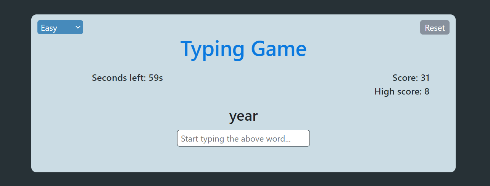

# Typing game

This is a simple typing game which you can start playing it right away after launching the app/site by clicking the **Start** button

## Select difficulty level

From the top left you can choose the difficulty level which you want

- Easy
- Medium
- Hard

## Starting the game

Upon starting the game you get to type the word displayed and whenever you type the correct word displayed,
your score gets incremented along with bonus time (based on the difficulty level).

### Bonus time based on difficulty level

- Easy → +3s
- Medium → +2s
- Hard → +1s

## Score and highest score

Once the game ends you can see your current score & the highest score.

You can restart the game by clicking the **Start again** button

> You can play the live game here https://easy-typing-game.netlify.app/
